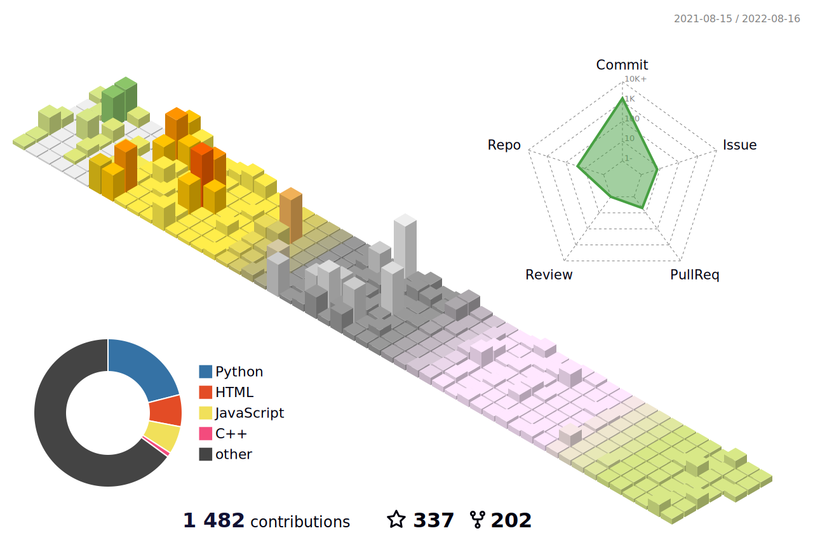

<h2 align="center">👋 Hi, I'm ZhaoDongyu :)</h2>

<!-- 贪吃蛇代码贡献图 -->

<!-- 

 
-->

<!-- metrics 基础资料 -->

 

<!-- GitHub数据统计 -->

  

 

<!-- GitHub奖杯🏆 -->

 

<!-- Dynamic Quotes -->

<!--
**ZhaoDongyu-AK47/ZhaoDongyu-AK47** is a ✨ _special_ ✨ repository because its `README.md` (this file) appears on your GitHub profile.

Here are some ideas to get you started:

- 🔭 I’m currently working on ...
- 🌱 I’m currently learning ...
- 👯 I’m looking to collaborate on ...
- 🤔 I’m looking for help with ...
- 💬 Ask me about ...
- 📫 How to reach me: ...
- 😄 Pronouns: ...
- ⚡ Fun fact: ...
-->
